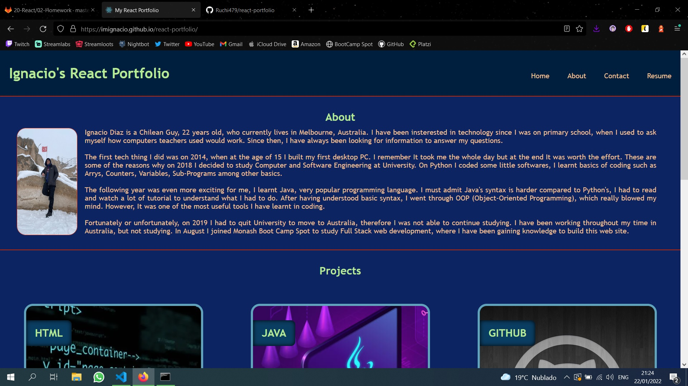
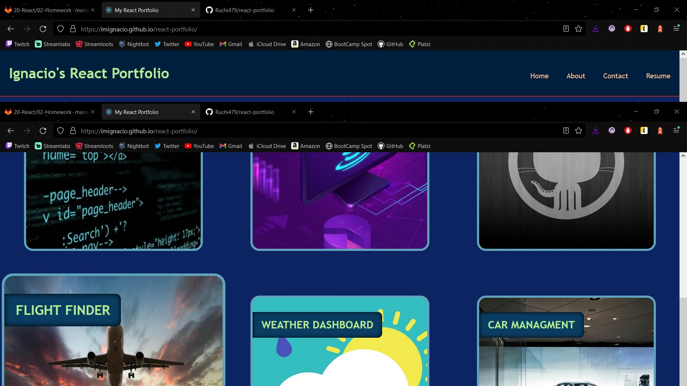
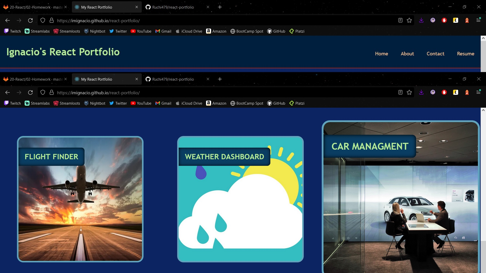

# REACT PORTFOLIO

# Table of Contents

- [Description](#Description)
- [Demo](#Demo)
- [Screenshots](#Screenshots)

## Description

Being a web developer means being part of a community. You’ll need a place to share your projects not only if you're applying for jobs or working as a freelancer but also so that you can share your work with fellow developers and collaborate on future projects. This project is a React portfolio.

## Demo

The following links redirect you to deployed application and github profile.

- https://github.com/imIgnacio/react-portfolio
- https://imignacio.github.io/react-portfolio/

## Screenshots

If you have any questions about the project, contact us at: https://github.com/imIgnacio

:)